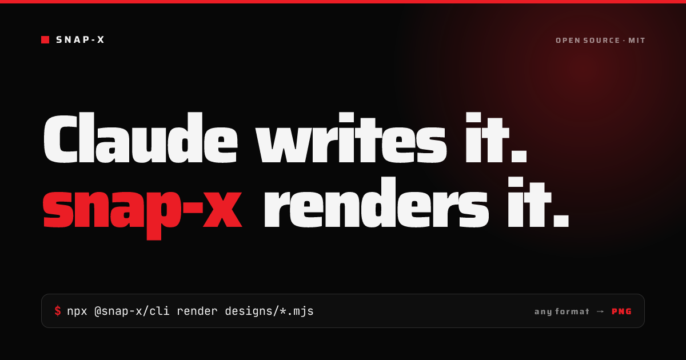
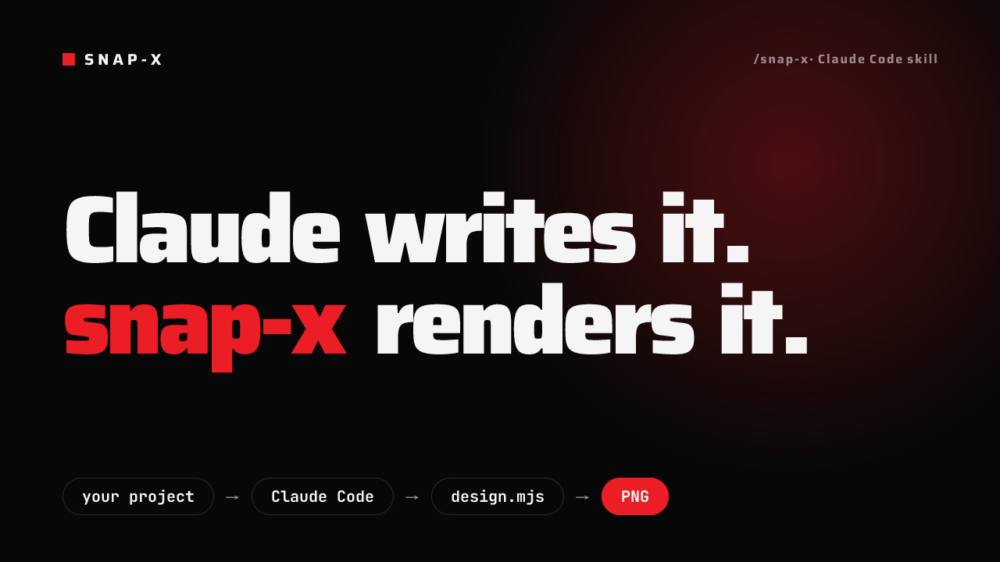
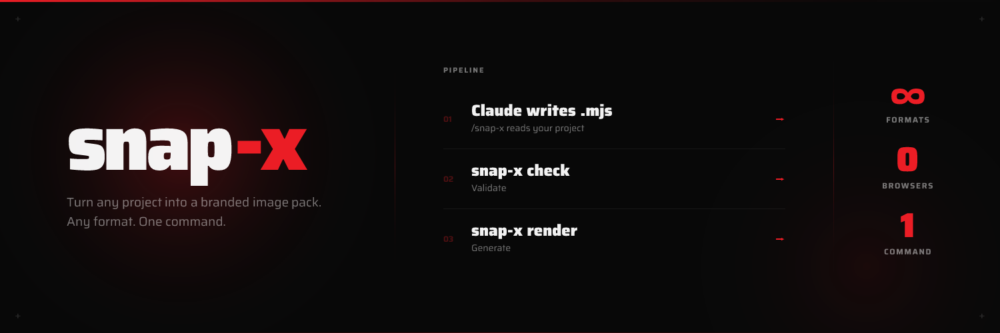
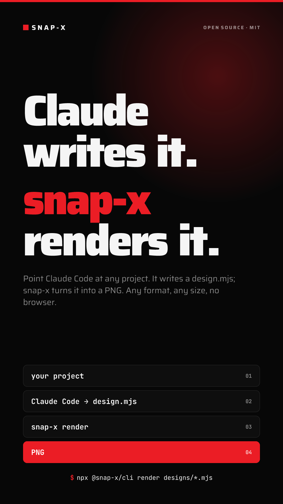
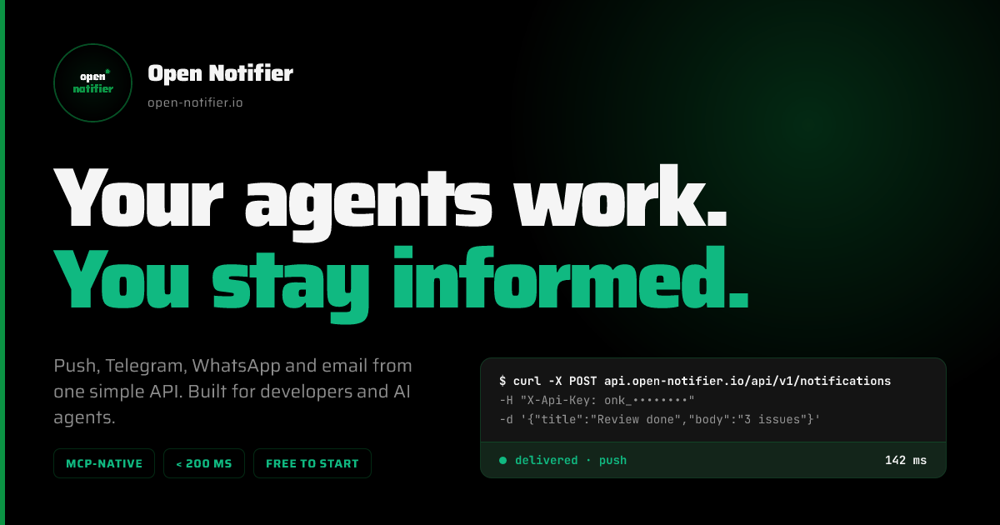
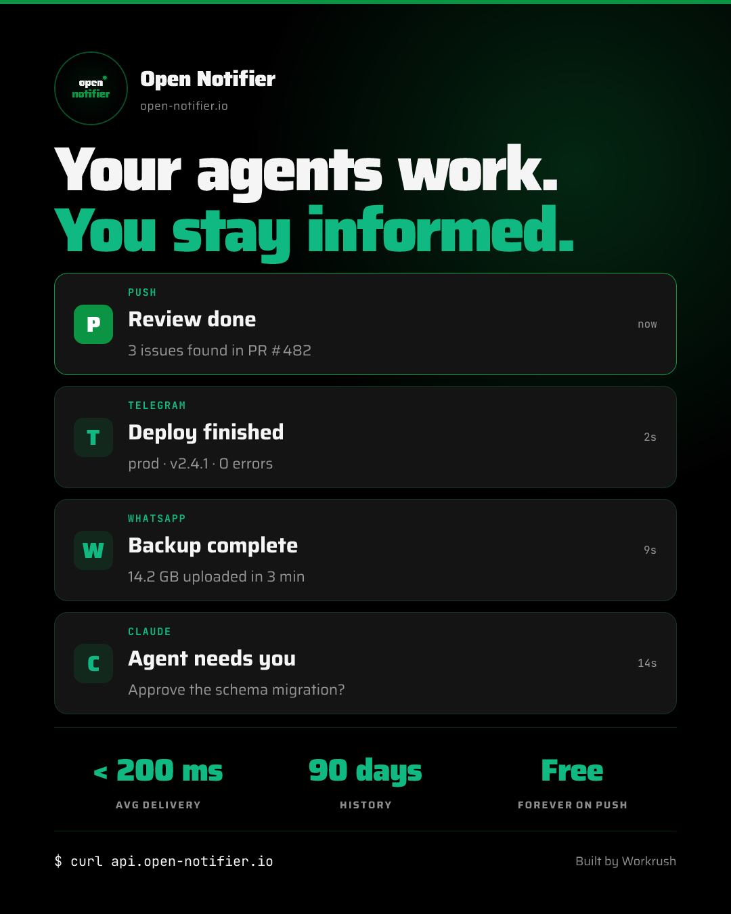

# snap-x


Render-only Satori pipeline: write a self-contained `.mjs` design file, get a PNG. No browser. No config. No auto-detection. Pure Node.js.

```bash
npx @snap-x/cli check  designs/*.mjs             # validate
npx @snap-x/cli render designs/*.mjs --out out   # Satori → PNG
```

That's the whole surface. Everything else — what the image says, what it looks like, what font it uses — lives in the `.mjs` file itself, not in flags or a config file.

---

## Examples

> snap-x's own images, made by snap-x: Claude Code ran the [`/snap-x` skill](#claude-code-skill) on this repo, wrote the designs in [`examples/snap-x/designs/`](examples/snap-x/designs), and rendered them. The README card above is one of them. Regenerate all five with `npm run examples`.

**OG card** — 1200×630



**Thumbnail** — 1280×720



**Cover banner** — 1500×500



**README card** — 1280×640


<details>
<summary>Poster — 1080×1920</summary>



</details>

### Another project: Open Notifier

snap-x doesn't need a repo, just facts about a project. For [open-notifier.io](https://open-notifier.io) the skill read the live site's meta tags and stylesheet (brand green `#0b9444`, Saira, real copy), found its icon (`favicon.svg`) and produced two cards, in [`examples/open-notifier/`](examples/open-notifier):

**OG card** — 1200×630



**Notifications card** — 1080×1350



### And another: HeyReach

Same idea for [heyreach.io](https://www.heyreach.io), read from the live site (copy, their Poppins font, navy and periwinkle palette, and their real logo from their CDN), in [`examples/heyreach/`](examples/heyreach):

**OG card** — 1200×630


**Senders card** — 1080×1350


---

## How it works

```
you (or an agent) write   →  designs/*.mjs   (self-contained Satori trees)
snap-x check               →  validates Satori CSS rules + a real render attempt
snap-x render               →  Satori (SVG) → resvg (PNG)
```

There's no `init`, no `snap-x.config.json`, no project auto-detection. A design file declares everything it needs and nothing external is merged into it — write it once, render it, done.

### Claude Code skill

The `/snap-x` skill is the intended way to use this: Claude **inspects your project and writes the design files for you** — tailored copy, brand colors, fonts — then checks and renders them.

```
/snap-x  →  Claude inspects project
         →  Claude plans copy per format
         →  Claude writes designs/*.mjs
         →  snap-x check + snap-x render → PNGs
```

Nothing stops you from writing `.mjs` files by hand instead — the skill just automates the part where you'd otherwise decide the copy and layout yourself.

---

## Quick start

```bash
npm install -g @snap-x/cli   # gives you the `snap-x` command; or skip installing and use `npx @snap-x/cli …`
```

Write a design file:

```js
// designs/og.mjs
export const FORMAT = { width: 1200, height: 630, name: "og.png" };
export const FONTS  = [{ family: "Inter", weights: [400, 700, 900] }]; // optional — defaults to Inter

export default function () {
  return {
    type: "div",
    props: {
      style: { width: 1200, height: 630, background: "#000", display: "flex", alignItems: "center", justifyContent: "center" },
      children: [
        { type: "div", props: { style: { color: "#fff", fontSize: 56, fontWeight: 900, display: "flex" }, children: ["Hello, world"] } },
      ],
    },
  };
}
```

Check and render it:

```bash
snap-x check  designs/og.mjs
snap-x render designs/og.mjs --out snap-output
```

Or point at everything in a directory at once:

```bash
snap-x render designs/*.mjs --out snap-output
```

---

## CLI

```
snap-x check  <paths...>
snap-x render <paths...> [--out <dir>]
```

`<paths...>` accepts any mix of:
- a literal file — `designs/og.mjs`
- a directory — `designs/` (expands to every `.mjs` inside)
- a glob with one trailing `*` — `designs/*.mjs`

| Flag | Default | Description |
|---|---|---|
| `--out` | `./snap-output` | Output directory (render only) |

That's the entire flag surface. No `--title`, `--desc`, `--font`, `--theme` — those decisions live inside the design file, because the file is self-contained.

---

## Design file format

A design file exports `FORMAT`, optionally `FONTS`, and a default export that's either a static tree or a **zero-argument** function (no config is ever passed in):

```js
export const FORMAT = { width: 1200, height: 630, name: "og.png" };
export const FONTS  = [{ family: "Saira", weights: [400, 700, 900] }]; // optional, defaults to Inter 400/700/900

export default function () {
  const accent = "#eb1d25"; // hardcode whatever you want — no themeOverride, no config
  return {
    type: "div",
    props: {
      style: { width: 1200, height: 630, background: "#000", display: "flex" },
      children: [ /* your layout here */ ],
    },
  };
}
```

**Satori rules** (the only constraints):
- Every container needs `display: "flex"` — no block, grid, or inline
- `children` must be an array
- `position: "absolute"` works; `position: "fixed"` does not
- No `z-index`, no CSS Grid, no CSS animations
- Text goes directly in `children`: `children: ["Hello"]`

Run `snap-x check` to catch structural violations and actually attempt a Satori render before you commit to a full batch.

### Static tree (no function needed)

```js
export const FORMAT = { width: 1200, height: 630, name: "og.png" };
export default {
  type: "div",
  props: { style: { width: 1200, height: 630, background: "#0a0a0a", display: "flex" }, children: [] },
};
```

### Async (local assets)

```js
import fs from "fs/promises";
import { fileURLToPath } from "url";

// Resolve assets relative to THIS file, so it renders correctly from any working directory.
const asset = async (rel, mime) =>
  `data:${mime};base64,${(await fs.readFile(fileURLToPath(new URL(rel, import.meta.url)))).toString("base64")}`;

export const FORMAT = { width: 1200, height: 630, name: "og.png" };

export default async function () {
  const logo = await asset("../assets/logo.png", "image/png"); // assets/ next to designs/

  return {
    type: "div",
    props: {
      style: { width: 1200, height: 630, background: "#000", display: "flex" },
      children: [
        // width AND height are required — keep the file's aspect ratio
        { type: "img", props: { src: logo, width: 200, height: 60, style: { display: "flex" } } },
      ],
    },
  };
}
```

PNG, JPEG and SVG work as embedded `` sources (**not** AVIF/WebP — convert those to PNG; an SVG containing `<text>` should be rasterised first). Resolving paths with `import.meta.url` means the design renders the same from any directory. The `/snap-x` skill finds a project's real logo and brand assets for you (favicons, header logo, `/brand` pages) and saves them in `assets/` with a `SOURCES.md`.

---

## Fonts

Declare exactly what a design needs via `FONTS` — any [Google Font](https://fonts.google.com) family, any weight list:

```js
export const FONTS = [
  { family: "Saira", weights: [400, 700, 900] },
  { family: "JetBrains Mono", weights: [400] },
];
```

Omit `FONTS` entirely and it defaults to Inter 400/700/900. Each file in a batch declares its own fonts independently — `og.mjs` and `poster.mjs` in the same `snap-x render` call can use completely different families. Fonts are fetched from Google Fonts and deduped across the batch; an unavailable font falls back to Inter with a warning instead of failing the render.

**Fonts are cached on disk**, so repeat renders are fast and work fully offline once a font has been downloaded (cold ≈ 11 s → warm ≈ 1.6 s for the five example designs). The cache lives in `$SNAP_X_CACHE_DIR`, else `$XDG_CACHE_HOME/snap-x/fonts`, else `~/.cache/snap-x/fonts`; delete that folder to clear it.

**Non-Latin text works without any setup.** If a design's text contains CJK, Korean, Arabic, Hebrew, Thai, Devanagari or Bengali (or Cyrillic/Greek/Latin-extended that your font lacks), snap-x downloads a small Noto Sans subset covering just those characters and uses it for the glyphs your font can't draw. Your `FONTS` always win where they have the glyph. Emoji are not supported yet.

---

## Icons

Design files are plain JavaScript — use any icon source:

**Emoji** (zero deps):
```js
{ type: "div", props: { style: { fontSize: 24, display: "flex" }, children: ["⚡"] } }
```

**Inline SVG path** (any icon library — Lucide, Heroicons, Phosphor, etc.):
```js
{
  type: "svg",
  props: {
    width: 24, height: 24, viewBox: "0 0 24 24", fill: "none",
    stroke: "#eb1d25", strokeWidth: 2, strokeLinecap: "round", strokeLinejoin: "round",
    children: [{ type: "path", props: { d: "M13 2L3 14h9l-1 8 10-12h-9l1-8z" } }],
  },
}
```

**Icon package** (install anything):
```js
import { getIcon } from "my-icon-pack";
```

---

## What you can fully customize

Every design file is independent and self-contained — there's no shared schema to fit into.

| Layer | How |
|---|---|
| Layout & composition | The whole `.mjs` tree — it's just JavaScript |
| Colors | Hardcode whatever hex/rgba values you want, per file |
| Typography | `FONTS` export — any Google Font(s), any weights, per file |
| Icons | Emoji, inline SVG paths, or any icon package |
| Logos & images | `async` default export + `fs.readFile` → base64 `` |
| Copy & content | Baked directly into the tree |
| Per-format design | Each `.mjs` is fully independent — poster can look nothing like OG |
| Output filename | `FORMAT.name` |
| Dimensions | `FORMAT.width` / `FORMAT.height` — any size Satori supports |
| Static vs dynamic | Export a plain object or a (possibly async) zero-arg function |

The design files are yours. snap-x is just the renderer.

---

## MCP server

snap-x ships an [MCP](https://modelcontextprotocol.io) server so AI agents (Cursor, Windsurf, Claude Desktop) can render and validate design files directly.

```bash
npm install -g @snap-x/mcp
```

```json
{
  "mcpServers": {
    "snap-x": {
      "command": "npx",
      "args": ["@snap-x/mcp"]
    }
  }
}
```

| Tool | Description |
|---|---|
| `render_designs` | Render one or more `.mjs` design files to PNG |
| `check_designs` | Validate one or more `.mjs` design files |
| `list_formats` | Common social-image dimensions, for reference only |

The calling agent is responsible for writing the `.mjs` files — snap-x only renders them. `list_formats` is just a reference list of common sizes; any `FORMAT` you write is valid.

---

## Claude Code skill

snap-x ships a `/snap-x` skill for [Claude Code](https://claude.ai/code). Install it as a plugin:

```
/plugin marketplace add ravikovind/snap-x
/plugin install snap-x@snap-x
```

Then:

```
/snap-x
/snap-x --font "Saira"
```

(Prefer manual? Copy `skills/snap-x/` into `~/.claude/skills/`.)

Claude inspects your project, plans the design, writes the `.mjs` design files, checks them, renders, and tells you exactly where to use each image.

---

## Packages

| Package | Description |
|---|---|
| [`@snap-x/cli`](packages/cli) | The `snap-x` command: `check` and `render` |
| [`@snap-x/core`](packages/core) | The engine: Satori renderer, font loader, checker, programmatic API |
| [`@snap-x/mcp`](packages/mcp) | MCP server exposing the same render/check as agent tools |

---

## License

MIT © [Ravi Kovind](https://ravikovind.com)
