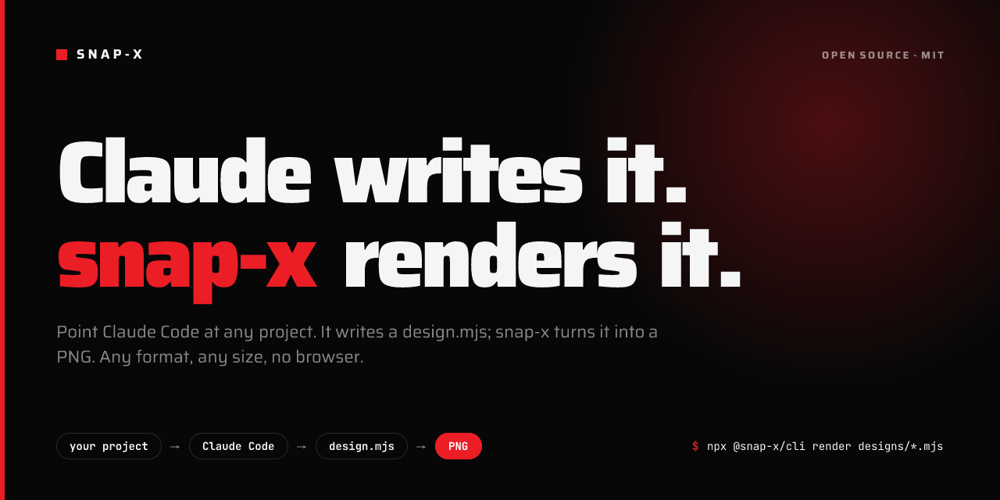

# snap-x



Render a self-contained [Satori](https://github.com/vercel/satori) `.mjs` design file to a PNG. Any size, no browser, no config. Pair it with Claude Code and it writes the designs for you.

## Quick start

```bash
npm install -g @snap-x/cli        # or skip installing: npx -y @snap-x/cli …

snap-x check  designs/*.mjs       # validate (structure + a real render attempt)
snap-x render designs/*.mjs --out snap-output
```

Paths can be a file, a directory, or a `*` glob. Files starting with `_` are shared helpers and are never rendered (even when your shell expands the glob). `--out` defaults to `./snap-output`.

## With Claude Code (recommended)

```
/plugin marketplace add ravikovind/snap-x
/plugin install snap-x@snap-x
/snap-x
```

Claude reads your project (or a website), pulls the brand — copy, colors, fonts, logo — plans the cards, writes the design files, checks and renders them. Manual install: copy `skills/snap-x/` to `~/.claude/skills/`.

## A design file

```js
export const FORMAT = { width: 1200, height: 630, name: "og.png" };
export const FONTS  = [{ family: "Inter", weights: [400, 700, 900] }]; // optional, default Inter

export default function () {                       // zero arguments; may be async
  return {
    type: "div",
    props: {
      style: { width: 1200, height: 630, background: "#000", display: "flex", alignItems: "center", justifyContent: "center" },
      children: [{ type: "div", props: { style: { color: "#fff", fontSize: 64, fontWeight: 900, display: "flex" }, children: ["Hello"] } }],
    },
  };
}
```

Everything the image needs lives in the file: colors, copy, fonts, size. There's no config file and no auto-detection.

**Rules (Satori):** every container needs `display: "flex"`; `children` is always an array; text is a string in `children`; no `z-index`, CSS grid, animations or `position: "fixed"`. `snap-x check` catches these.

**Fonts:** any Google Font via `FONTS`, per file. Fonts are cached on disk (`$SNAP_X_CACHE_DIR`, else `~/.cache/snap-x/fonts`) so repeat renders are fast and work offline. CJK, Korean, Arabic, Hebrew, Thai, Devanagari and Bengali get an automatic Noto fallback. Emoji and symbols the font lacks (`✔`, and `→` in some fonts) render as blank boxes — `snap-x check` warns about them; draw them as SVG.

**Logos and images:** make the export `async` and embed base64 `` nodes. Resolve paths from the design file so it renders from any directory:

```js
import fs from "fs/promises";
import { fileURLToPath } from "url";
const asset = async (rel, mime) =>
  `data:${mime};base64,${(await fs.readFile(fileURLToPath(new URL(rel, import.meta.url)))).toString("base64")}`;
// { type: "img", props: { src: await asset("../assets/logo.png", "image/png"), width: 231, height: 44 } }
```

PNG, JPEG and SVG work. AVIF and WebP don't (convert to PNG), and an SVG containing `<text>` must be rasterised first. Give both `width` and `height`, at the file's real aspect ratio.

## MCP server

```json
{ "mcpServers": { "snap-x": { "command": "npx", "args": ["@snap-x/mcp"] } } }
```

Tools: `render_designs`, `check_designs`, `list_formats`. The agent writes the `.mjs` files; the server renders and validates them. For agents without the skill it also serves the design rules: a `snap-x://design-guide` resource and a `design_cards` prompt.

## Examples

[`examples/`](examples) has complete packs made with the skill — snap-x itself, Open Notifier, HeyReach and a LinkedIn cover. Each has its designs, assets, plan and output. Regenerate all with `npm run examples`.

## Packages

| Package | What it is |
|---|---|
| [`@snap-x/cli`](packages/cli) | the `snap-x` command |
| [`@snap-x/core`](packages/core) | renderer, font loader, checker, programmatic API |
| [`@snap-x/mcp`](packages/mcp) | MCP server |

Architecture notes: [FLOW.md](FLOW.md) · Changes: [CHANGELOG.md](CHANGELOG.md)

## License

MIT © [Ravi Kovind](https://ravikovind.com)
