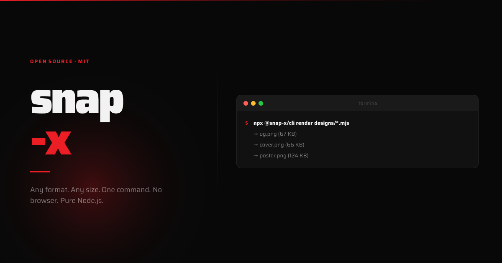
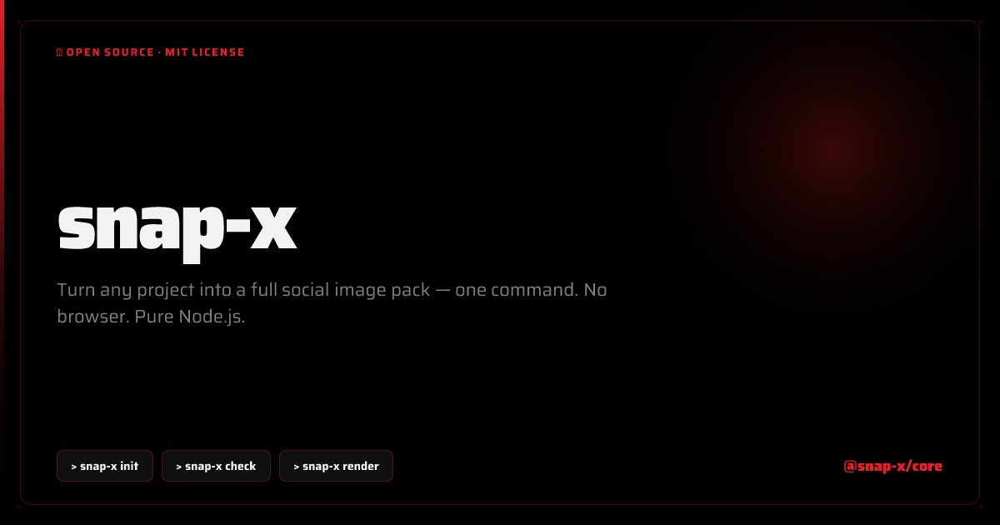
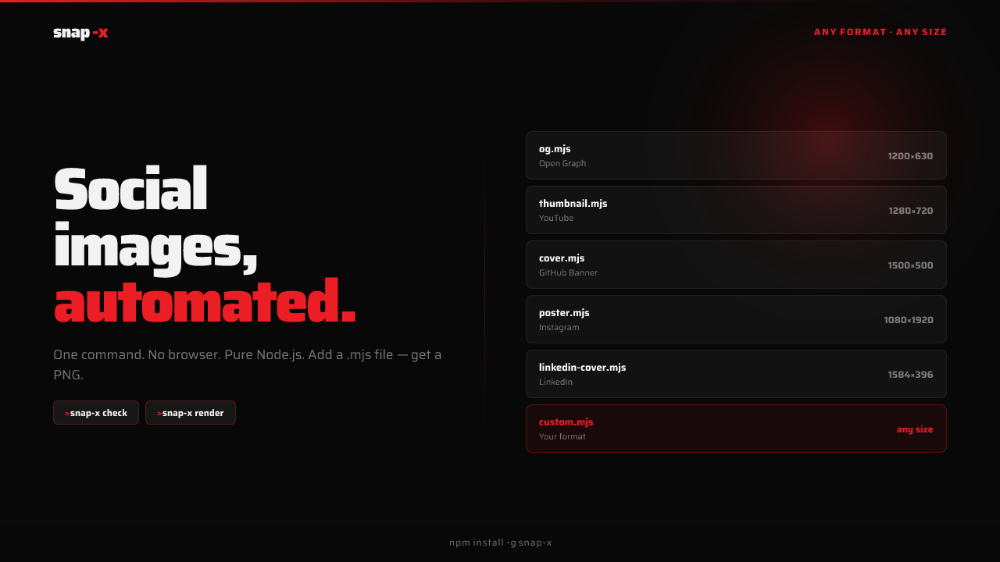
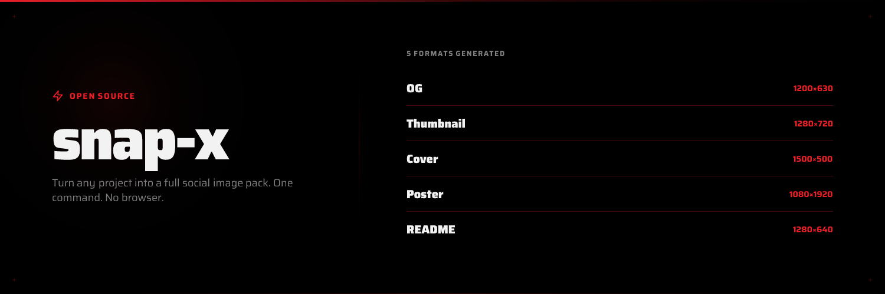
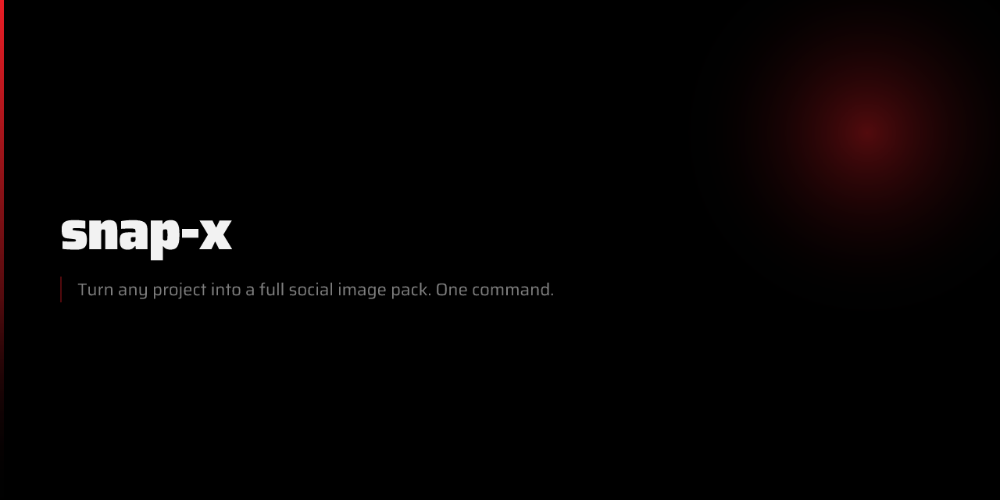
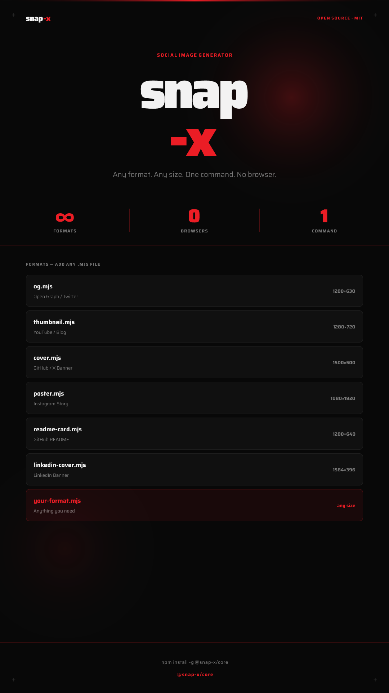

# snap-x



Turn any project into a full social image pack — one command. No browser. Pure Node.js.

OG card · Thumbnail · Cover banner · Poster · README card

```bash
npx snap-x init    # scaffold config + design files
npx snap-x check   # validate designs
npx snap-x render  # Satori → PNG
```

---

## Examples

| OG (1200×630) | Thumbnail (1280×720) |
|---|---|
|  |  |

| Cover (1500×500) | README card (1280×640) |
|---|---|
|  |  |

<details>
<summary>Poster (1080×1920)</summary>



</details>

> All generated with `snap-x render --font Saira` — snap-x's own images, made by snap-x.

---

## What it generates

| Format | Size | Use case |
|---|---|---|
| `og.png` | 1200×630 | Open Graph / Twitter card |
| `thumbnail.png` | 1280×720 | YouTube / blog header |
| `cover.png` | 1500×500 | GitHub / Twitter/X banner |
| `poster.png` | 1080×1920 | Instagram story / vertical |
| `readme-card.png` | 1280×640 | GitHub README social preview |

---

## How it works

snap-x uses a **Satori pipeline** — the same approach React uses to render without a browser.

```
snap-x init    →  writes snap-x/designs/*.mjs  (Satori trees — edit freely)
snap-x check   →  validates CSS rules Satori requires
snap-x render  →  Satori (SVG) → resvg (PNG)
```

Design files are plain `.mjs` — you own them, edit them, commit them. Re-render any time.

### Claude Code skill

The `/snap-x` skill takes this further: Claude **writes the design files for you**, tailored to your project's brand, fonts, and content — then renders them. Same philosophy as `/brag` for videos, but for static images.

```
/snap-x  →  Claude inspects project
         →  Claude plans copy per format
         →  Claude writes snap-x/designs/*.mjs
         →  snap-x check + snap-x render → PNGs
```

---

## Quick start

```bash
# 1. Install
npm install -g @snap-x/core

# 2. Init your project
cd your-project
snap-x init

# 3. Edit snap-x.config.json
# 4. Customize snap-x/designs/*.mjs  (or let Claude do it with /snap-x)

# 5. Validate + render
snap-x check
snap-x render
```

Output lands in `./snap-output/`.

---

## CLI

```
snap-x init [--force]
snap-x check [--format <id>]
snap-x render [--format <id>] [--theme dark|light] [--out <dir>]
```

| Flag | Default | Description |
|---|---|---|
| `--format` | all | One format: `og`, `cover`, `thumbnail`, `poster`, `readme` |
| `--theme` | `dark` | Visual theme (`dark`, `light`, `midnight`, `forest`, `minimal`) |
| `--out` | `./snap-output` | Output directory |
| `--title` | auto-detected | Override project title |
| `--desc` | auto-detected | Override description |
| `--domain` | auto-detected | Override domain/brand |
| `--tags` | auto-detected | Comma-separated tags |
| `--font` | `Inter` | Any Google Font family name |
| `--project` | `cwd` | Path to project directory |

---

## Config file

`snap-x init` creates `snap-x.config.json`:

```json
{
  "title": "My Project",
  "description": "A short description of what this project does.",
  "domain": "myproject.com",
  "tags": ["Open Source", "TypeScript", "Node.js"],
  "stack": ["Node.js", "TypeScript"],
  "theme": "dark",
  "font": "Inter",
  "outDir": "./snap-output"
}
```

snap-x auto-detects from `package.json`, `README.md`, Next.js config, and `globals.css`.

---

## Design files

After `snap-x init`, designs live in `./snap-x/designs/`. Each is a Satori tree:

```js
// snap-x/designs/og.mjs
import { getTheme } from "@snap-x/core/src/themes/index.mjs";

export const FORMAT = { width: 1200, height: 630, name: "og.png" };

export default function (config) {
  const t = getTheme(config.theme);
  const { title, description, domain, tags } = config;

  return {
    type: "div",
    props: {
      style: { width: 1200, height: 630, background: t.bg, display: "flex" },
      children: [
        // your layout here
      ],
    },
  };
}
```

**Satori rules** (the only constraints):
- Every container needs `display: "flex"` — no block, grid, or inline
- `children` must be an array
- No `z-index`, no `position: "fixed"`, no CSS animations

Run `snap-x check` to catch any violations before rendering.

---

## Auto-detection

snap-x reads your project before generating:

- **`package.json`** — name, description, keywords → title, description, tags
- **`README.md`** — first heading + paragraph → title, description
- **`next.config.*`** — detects Next.js, adds to stack
- **`app/globals.css`** — `--font-sans`, accent color → font + theme override

`snap-x render` works out of the box with no config.

---

## MCP server

snap-x ships an [MCP](https://modelcontextprotocol.io) server so AI agents (Cursor, Windsurf, Claude Desktop) can generate images directly.

```bash
npm install -g @snap-x/mcp
```

```json
{
  "mcpServers": {
    "snap-x": {
      "command": "npx",
      "args": ["@snap-x/mcp"]
    }
  }
}
```

| Tool | Description |
|---|---|
| `generate_images` | Build the full image pack for a project |
| `init_config` | Scaffold config + design files |
| `list_formats` | List formats with dimensions |

---

## Claude Code skill

snap-x ships a `/snap-x` skill for [Claude Code](https://claude.ai/code).

Copy `skills/snap-x/` into your Claude Code skills directory, then:

```
/snap-x
/snap-x --theme light
/snap-x --format og
/snap-x --font "Saira"
```

Claude inspects your project, plans the design, writes the `.mjs` design files, validates them, renders, and tells you exactly where to use each image.

---

## Packages

| Package | Description |
|---|---|
| [`@snap-x/core`](packages/core) | CLI + Satori renderer + default designs |
| [`@snap-x/mcp`](packages/mcp) | MCP server for AI agent integration |

---

## License

MIT © [VoltVave Innovations](https://voltvave.com)
