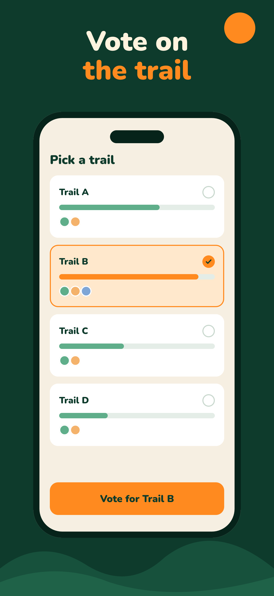
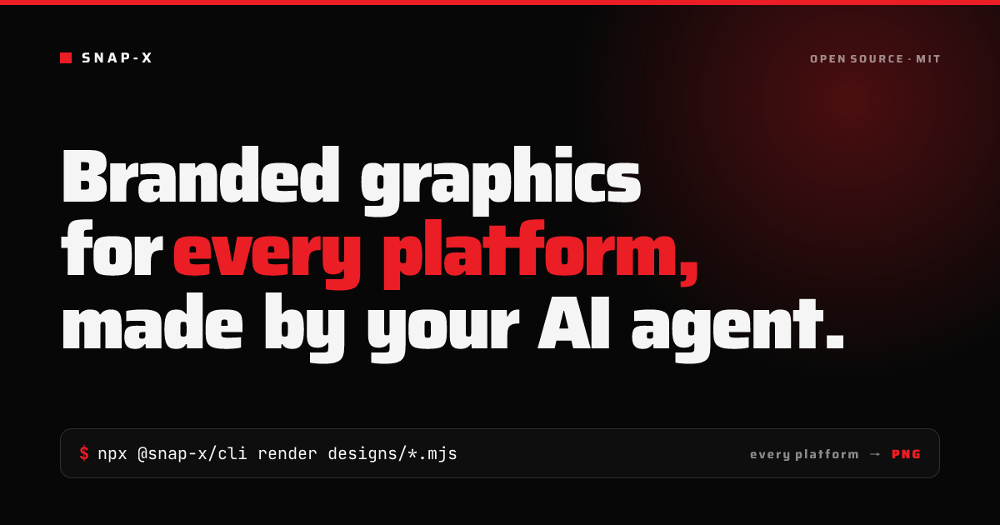
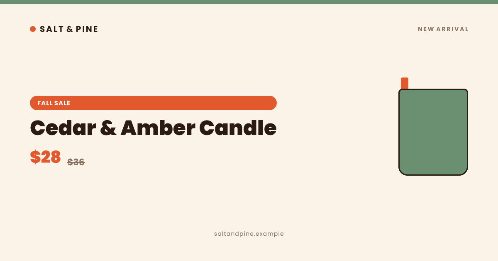
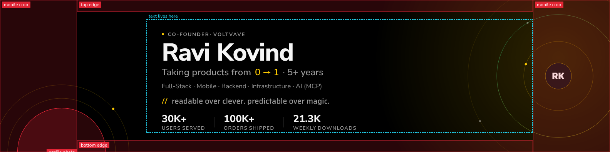
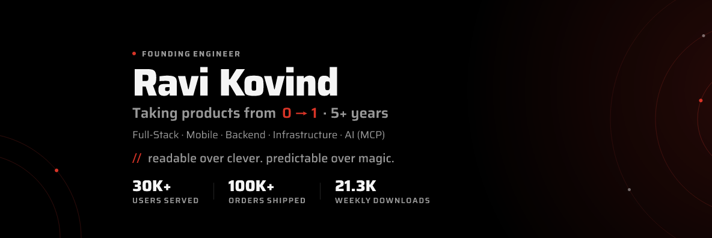

# snap-x

**Branded graphics for every platform, made by your AI agent.**
Thumbnails, covers, banners, store graphics and more: sized right, checked, and repeatable.

<table>
<tr>
<td><a href="examples/kite"></a><br><sub>YouTube thumbnail</sub></td>
<td><a href="examples/ravikovind"></a><br><sub>LinkedIn cover</sub></td>
<td><a href="examples/kite"></a><br><sub>App Store screenshot</sub></td>
</tr>
<tr>
<td><a href="examples/kite"></a><br><sub>Play feature graphic</sub></td>
<td><a href="examples/snap-x"></a><br><sub>OG / link preview card</sub></td>
<td><a href="examples/storefront"></a><br><sub>E-commerce banner</sub></td>
</tr>
</table>

All made with the same tool, from a design file — not screenshots or mockups. Every image above is real `snap-x` output; see [Examples](#examples).

## Get started with Claude Code

```
/plugin marketplace add ravikovind/snap-x
/plugin install snap-x@snap-x
/snap-x
```

Point it at a repo, a website URL, or just describe the brand — it finds your real logo, colors, fonts and copy, picks the formats you need, writes one design file per format, checks and renders them, and looks at every image before handing them over. Manual install: copy `skills/snap-x/` to `~/.claude/skills/`.

## Or with any MCP agent

```json
{ "mcpServers": { "snap-x": { "command": "npx", "args": ["@snap-x/mcp"] } } }
```

Works the same way in Claude Desktop, Cursor, Windsurf, or any MCP client: the agent writes the `.mjs` files, the server renders and checks them. See [MCP server](#mcp-server) below.

## How it works

1. **Point.** Give your agent a repo, a website URL or a written brief.
2. **Plan.** It pulls your real logo, colors, fonts and copy, picks the formats you need, and writes a plan.
3. **Render and verify.** It writes one design file per format, checks them, renders exact-size PNGs, overlays each platform's danger zones, and looks at every image before handing them over.

## Correct for every platform

<table>
<tr>
<td><a href="examples/ravikovind/guides"></a><br><sub><code>snap-x guides</code> — profile photo and edge zones overlaid</sub></td>
<td><a href="examples/ravikovind/guides"></a><br><sub>the same cover, mobile-cropped</sub></td>
</tr>
</table>

22 built-in formats with sizes and rules: link previews, YouTube thumbnails/Shorts/channel art, LinkedIn/X covers and posts, Instagram posts and stories, Google Play graphics and screenshots, App Store screenshots, and more (`snap-x formats`, or `snap-x formats <id>` for notes and zones — sizes checked against official docs are marked verified). `snap-x guides` overlays a format's danger zones — profile photo, duration badge, story UI, cropped edges — on your design and renders the mobile crop, so you can *see* whether text is covered. `snap-x check` catches characters the font can't draw. **Store graphics get no alpha channel automatically:** set `alpha: false` in `FORMAT` and `check`/`render` produce an opaque RGB PNG.

## Exact and repeatable

The design is a code file, not a canvas someone can nudge. Your real logo is embedded, not redrawn; text is exactly what you wrote; the size is exact — no cropping to fit a platform. Change one word and only that word moves. Re-render a whole series or catalogue from one template. It renders locally, with no browser.

## Use cases

| Use case | Formats | Example |
|---|---|---|
| YouTube creators | thumbnails, channel art, Shorts | [`examples/creator-series`](examples/creator-series), [`examples/kite`](examples/kite) |
| Personal brand | LinkedIn cover, X header | [`examples/ravikovind`](examples/ravikovind) |
| App makers | App Store screenshots, Play feature graphic | [`examples/kite`](examples/kite) |
| Websites and projects | OG/link previews, README cards, GitHub social preview | [`examples/snap-x`](examples/snap-x), [`examples/open-notifier`](examples/open-notifier), [`examples/heyreach`](examples/heyreach) |
| E-commerce / marketing | sale and promo banners, Instagram posts and stories | [`examples/storefront`](examples/storefront) |

## FAQ

**Why not just use an AI image generator?**
Use one. Tools like Nano Banana and ChatGPT are great at pixels: photos, illustration, texture, mood. snap-x does the work around the art:
- **Exact sizes.** Image models generate in preset aspect ratios, so exact platform sizes (a 1584×396 LinkedIn cover, a 1024×500 Play feature graphic) usually mean cropping. snap-x renders the exact size.
- **Your real logo.** It's embedded from the file, not redrawn.
- **Precise edits.** Change "Episode 12" to "Episode 13" and nothing else moves.
- **Series and batches.** One template gives identical layouts across a thumbnail series, a catalogue of banners or localized screenshots.
- **Platform rules.** Safe zones, mobile crops and store no-alpha rules are built in and checked.
- **Yours, locally.** The design is a code file you can diff and version; renders run on your machine.

They combine well: generate a background or product shot, then let snap-x place it with your logo and copy at every size.

**Do I need Claude Code?**
No. The MCP server works with any MCP agent (Claude Desktop, Cursor, Windsurf), and you can write designs by hand with the CLI — see below.

**Can it make photos or illustrations?**
No. snap-x lays out text, shapes, logos and images you supply; it doesn't generate art. Bring your own images, or generate them elsewhere and let snap-x place them with your logo, copy and platform rules.

## Write designs by hand (CLI)

```bash
npm install -g @snap-x/cli        # or skip installing: npx -y @snap-x/cli …

snap-x check  designs/*.mjs       # validate (structure, a real render, blank-box glyphs, store-alpha)
snap-x render designs/*.mjs --out snap-output
snap-x formats                    # YouTube, X, LinkedIn, Play Store, App Store … sizes + placement zones
snap-x guides designs/*.mjs       # draw a platform's danger zones (+ mobile crop) over your designs
```

Paths can be a file, a directory, or a `*` glob. Files starting with `_` are shared helpers and are never rendered (even when your shell expands the glob). `--out` defaults to `./snap-output`.

### A design file

```js
export const FORMAT = { width: 1200, height: 630, name: "og.png" };
export const FONTS  = [{ family: "Inter", weights: [400, 700, 900] }]; // optional, default Inter

export default function () {                       // zero arguments; may be async
  return {
    type: "div",
    props: {
      style: { width: 1200, height: 630, background: "#000", display: "flex", alignItems: "center", justifyContent: "center" },
      children: [{ type: "div", props: { style: { color: "#fff", fontSize: 64, fontWeight: 900, display: "flex" }, children: ["Hello"] } }],
    },
  };
}
```

Everything the image needs lives in the file: colors, copy, fonts, size. There's no config file and no auto-detection.

**Rules (Satori):** every container needs `display: "flex"`; `children` is always an array; text is a string in `children`; no `z-index`, CSS grid, animations or `position: "fixed"`. `snap-x check` catches these.

**Fonts:** any Google Font via `FONTS`, per file. Fonts are cached on disk (`$SNAP_X_CACHE_DIR`, else `~/.cache/snap-x/fonts`) so repeat renders are fast and work offline. CJK, Korean, Arabic, Hebrew, Thai, Devanagari and Bengali get an automatic Noto fallback. Emoji work (drawn as Twemoji images, cached). Other symbols the font lacks (`✓`, and `→` in some fonts) render as blank boxes — `snap-x check` warns about them; draw them as SVG.

**Logos and images:** make the export `async` and embed base64 `` nodes. Resolve paths from the design file so it renders from any directory:

```js
import fs from "fs/promises";
import { fileURLToPath } from "url";
const asset = async (rel, mime) =>
  `data:${mime};base64,${(await fs.readFile(fileURLToPath(new URL(rel, import.meta.url)))).toString("base64")}`;
// { type: "img", props: { src: await asset("../assets/logo.png", "image/png"), width: 231, height: 44 } }
```

PNG, JPEG and SVG work. AVIF and WebP don't (convert to PNG), and an SVG containing `<text>` must be rasterised first. Give both `width` and `height`, at the file's real aspect ratio.

## MCP server

```json
{ "mcpServers": { "snap-x": { "command": "npx", "args": ["@snap-x/mcp"] } } }
```

Tools: `render_designs`, `check_designs`, `preview_guides`, `list_formats`. The agent writes the `.mjs` files; the server renders and validates them. For agents without the skill it also serves the design rules: a `snap-x://design-guide` resource and a `design_cards` prompt.

## Examples

[`examples/`](examples) has complete packs made with the skill: snap-x itself, Open Notifier, HeyReach, a LinkedIn cover, an App Store/Play Store listing pack, a fictional e-commerce brand and a fictional YouTube series — each built from a repo, a site, or a written brief. Each has its designs, assets, plan and output. Regenerate all with `npm run examples`.

## Packages

| Package | What it is |
|---|---|
| [`@snap-x/cli`](packages/cli) | the `snap-x` command |
| [`@snap-x/core`](packages/core) | renderer, font loader, checker, programmatic API |
| [`@snap-x/mcp`](packages/mcp) | MCP server |

Architecture notes: [FLOW.md](FLOW.md) · Principles: [PRINCIPLES.md](PRINCIPLES.md) · Changes: [CHANGELOG.md](CHANGELOG.md)

## License

MIT © [Ravi Kovind](https://ravikovind.com)
