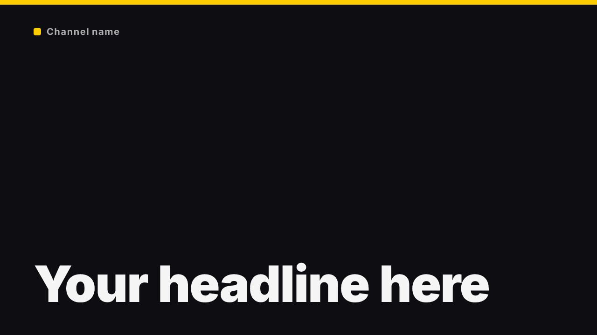
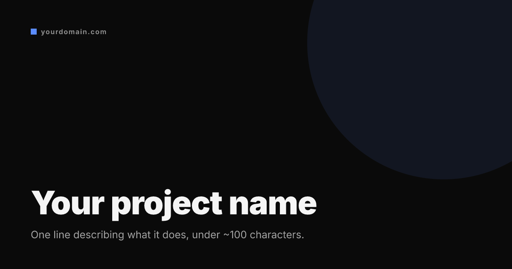
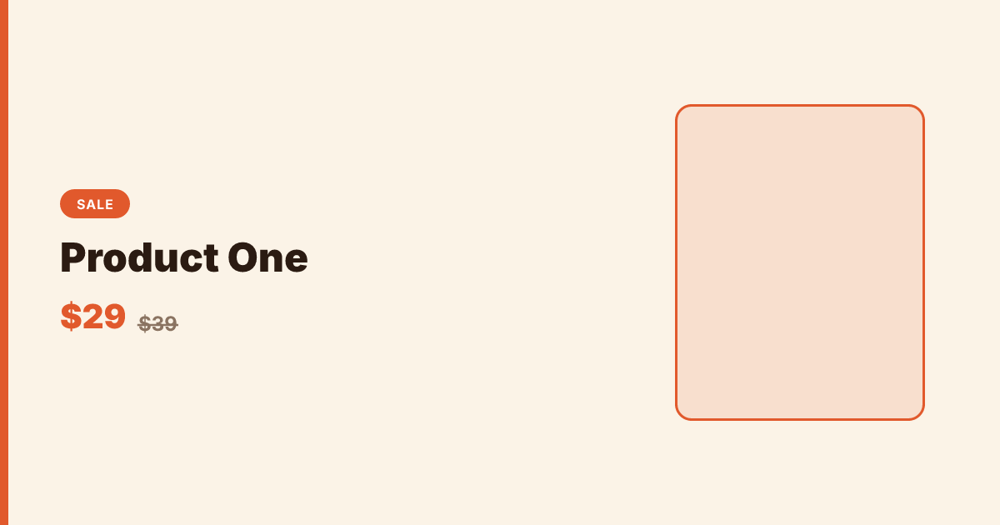
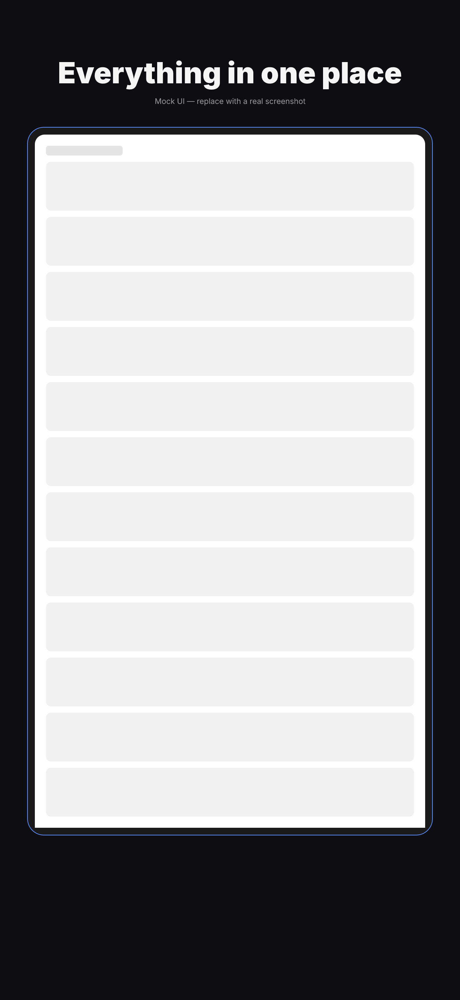
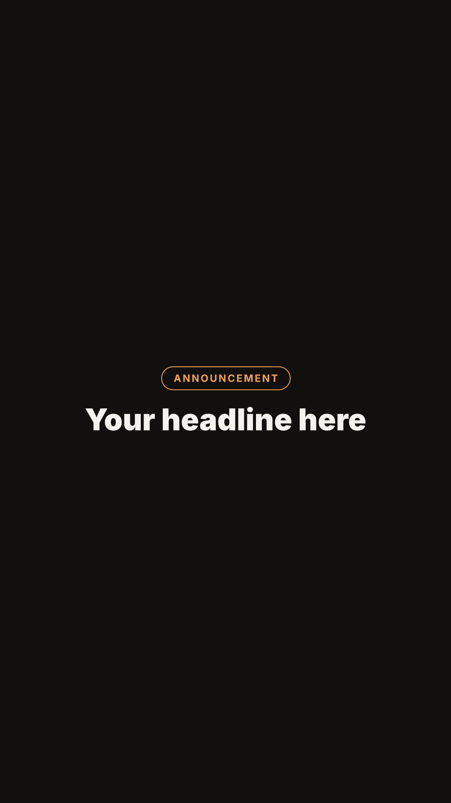

# Starter templates

Six brand-neutral design files, ready to copy into your own `designs/` and edit. Each:

- has a clearly-marked **"EDIT THESE VALUES"** block at the top — that's the only part you should need to touch to get your own brand in
- names its **archetype** in a comment (see [`skills/snap-x/references/design-principles.md`](../skills/snap-x/references/design-principles.md) § Archetypes)
- passes `snap-x check` with **zero warnings**
- has a committed preview PNG (regenerate all of them: `npm run examples`)

| Preview | Template | Archetype |
|---|---|---|
|  | [`youtube-thumbnail.mjs`](youtube-thumbnail.mjs) | Big type |
|  | [`linkedin-cover.mjs`](linkedin-cover.mjs) | Big type (with the platform's real safe/avoid zones) |
|  | [`og-card.mjs`](og-card.mjs) | Big type |
|  | [`sale-banner.mjs`](sale-banner.mjs) | Split — `VARIANTS`: one row per product |
|  | [`app-store-screenshot.mjs`](app-store-screenshot.mjs) | Device mock — `VARIANTS`: one row per shot, `alpha: false` |
|  | [`instagram-story.mjs`](instagram-story.mjs) | Centred badge |

`sale-banner.mjs` and `app-store-screenshot.mjs` use `VARIANTS` (see README.md's "Variants" section) since a promo series and a screenshot series are the two cases that come up constantly — copy the pattern for your own series instead of writing one file per image.

Checked and regenerated as part of the repo's normal example tooling: `npm run examples:check`, `npm run examples`, `npm run examples:diff`.
